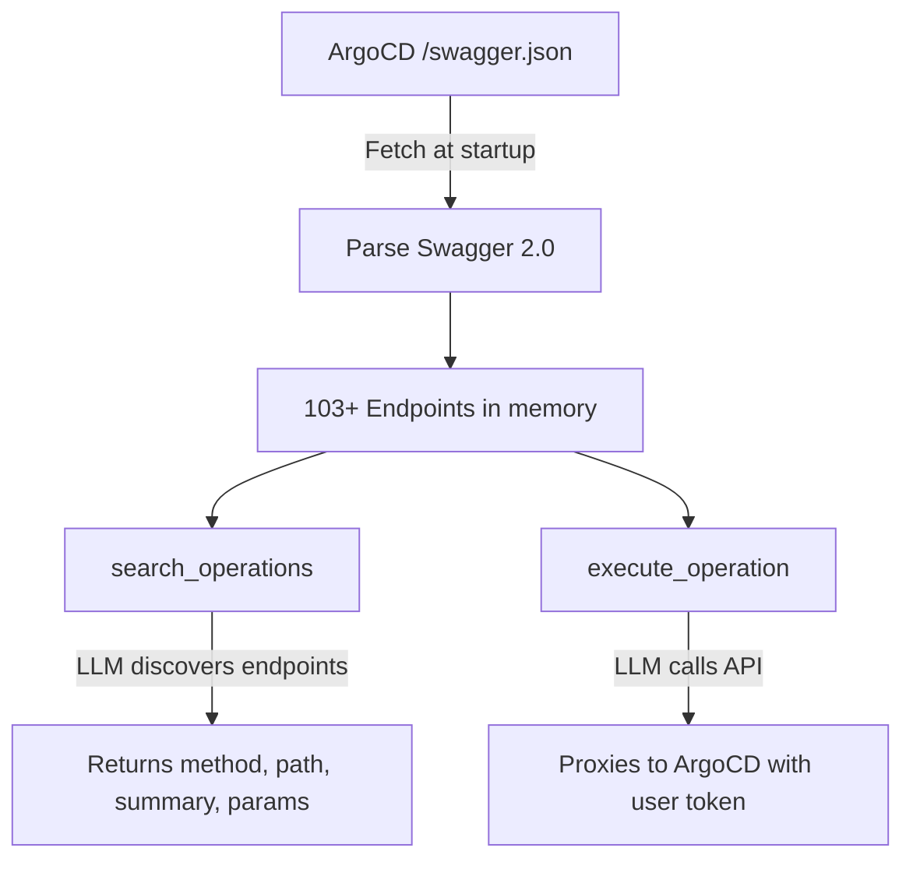

<p align="center">
  
</p>

<h1 align="center">argocd-mcp</h1>

<p align="center">
  <strong>The entire ArgoCD API, exposed to LLMs via MCP.</strong><br/>
  103+ endpoints. 2 tools. Zero hardcoded handlers.
</p>

<p align="center">
  <a href="#quick-start">Quick Start</a> &bull;
  <a href="#how-it-works">How It Works</a> &bull;
  <a href="#oauth-via-argocd-dex-per-user-rbac">OAuth</a> &bull;
  <a href="#configuration">Configuration</a>
</p>

---

Most ArgoCD MCP servers hardcode a few operations: list apps, sync, get status. When ArgoCD adds a new feature, you wait for the maintainer to add it.

**argocd-mcp** takes a different approach, inspired by [Cloudflare's MCP server](https://github.com/cloudflare/mcp) which covers 2500+ endpoints with only 2 tools. It reads ArgoCD's OpenAPI spec at startup and exposes every endpoint through just 2 tools: `search` and `execute`. New ArgoCD version? Restart the server. Done.

- **103+ endpoints**, 2 tools, ~200 tokens of system prompt
- Works with **Claude Desktop, Claude Code, Cursor**, or any MCP client
- **No code per endpoint** — the OpenAPI spec is the source of truth
- **Two auth modes**: static token or OAuth via ArgoCD Dex (per-user RBAC)
- **Read-only mode** — disable all write operations with a single flag
- **Resource scoping** — restrict which ArgoCD resources are exposed with `ALLOWED_RESOURCES`
- **Prompt templates** — pre-packaged workflows for common operations (unhealthy apps, diff, rollback, logs)
- **Audit logging** — structured JSON logs for every tool call (user, method, path, status, duration)
- **Optional semantic search** via Ollama embeddings

## How It Works



1. At startup, the server fetches ArgoCD's Swagger spec
2. It parses every endpoint (method, path, summary, parameters, request body schema)
3. **`search_operations`** — keyword or semantic search across all endpoints
4. **`execute_operation`** — generic HTTP proxy to ArgoCD

---

## Quick Start

### Static Token (simple)

Best for local dev, CI/CD, or single-user setups. Uses a static ArgoCD API token.

#### Claude Code

```bash
claude mcp add argocd -s user -- \
  docker run --rm -i \
  -e ARGOCD_BASE_URL=https://argocd.example.com \
  -e ARGOCD_TOKEN=your-token \
  ghcr.io/matthisholleville/argocd-mcp:latest
```

#### Claude Desktop

Add to your Claude Desktop MCP config (`claude_desktop_config.json`):

```json
{
  "mcpServers": {
    "argocd": {
      "command": "docker",
      "args": ["run", "--rm", "-i",
        "-e", "ARGOCD_BASE_URL=https://argocd.example.com",
        "-e", "ARGOCD_TOKEN=your-token",
        "ghcr.io/matthisholleville/argocd-mcp:latest"
      ]
    }
  }
}
```

---

### OAuth via ArgoCD Dex (per-user RBAC)

Best for multi-user, production setups. Each user authenticates with their own identity via ArgoCD's built-in Dex. **No static token needed** — the user's Dex `id_token` is forwarded to ArgoCD, which applies its RBAC policies per user.

**Step 1: Start the server**

```bash
docker run -p 8080:8080 \
  -e ARGOCD_BASE_URL=https://argocd.example.com \
  -e MCP_TRANSPORT=http \
  -e AUTH_MODE=oauth \
  -e DEX_CLIENT_ID=argo-cd-cli \
  -e SERVER_BASE_URL=http://localhost:8080 \
  ghcr.io/matthisholleville/argocd-mcp:latest
```

**Step 2: Connect your MCP client**

#### Claude Code

```bash
claude mcp add --transport http --callback-port 9382 argocd http://localhost:8080/mcp
```

Then run `/mcp` inside Claude Code to authenticate via the browser.

#### Claude Desktop

Claude Desktop requires a publicly accessible URL (the OAuth redirect goes through `claude.ai`). Expose the server via a reverse proxy or ngrok, then set `SERVER_BASE_URL` accordingly.

Add the public URL as a remote MCP server in **Settings > Connectors** (e.g. `https://mcp.example.com/mcp`). Claude Desktop handles the OAuth flow automatically.

<details>
<summary><strong>Required: ArgoCD Dex configuration</strong></summary>

<br/>

The `argo-cd-cli` Dex client needs the callback URLs for your MCP clients registered as redirect URIs. Add a `staticClients` override in your ArgoCD `dex.config`:

```yaml
staticClients:
  - id: argo-cd-cli
    name: Argo CD CLI
    public: true
    redirectURIs:
      - http://localhost
      - http://localhost:8085/auth/callback
      - http://localhost:9382/callback
      - https://claude.ai/api/mcp/auth_callback
```

| Redirect URI | Used by |
|---|---|
| `http://localhost` | ArgoCD CLI (`argocd login --sso`) |
| `http://localhost:8085/auth/callback` | ArgoCD CLI (legacy) |
| `http://localhost:9382/callback` | Claude Code (`--callback-port 9382`) |
| `https://claude.ai/api/mcp/auth_callback` | Claude Desktop |

ArgoCD auto-registers `argo-cd-cli` at startup and prepends it to the client list. Dex uses the last definition when there are duplicate IDs, so our override wins safely ([ref](https://github.com/argoproj/argo-cd/blob/master/util/dex/config.go)).

> **Note**: The `argo-cd-cli` client is public (no secret), so this override is safe — unlike overriding `argo-cd` which has an internal secret ([ref](https://github.com/argoproj/argo-cd/issues/19787)).

**How it works under the hood:**

- The MCP server acts as an OAuth proxy to ArgoCD's Dex
- Uses the `argo-cd-cli` public client (no secret needed)
- The Dex `id_token` (with `aud: argo-cd-cli`) is swapped into the `access_token` field and forwarded as Bearer to ArgoCD
- ArgoCD validates the token against Dex's JWKS and applies **per-user RBAC**
- Each user only sees the applications and resources they have access to

</details>

---

## Semantic Search (optional)

Enable Ollama-powered vector search for better results on natural language queries:

```bash
docker compose up --build -d  # Starts Ollama + argocd-mcp with embeddings
```

Set `EMBEDDINGS_ENABLED=true`, `OLLAMA_URL`, and `EMBEDDINGS_MODEL` (defaults to `nomic-embed-text`).

---

## Read-Only Mode (optional)

Set `DISABLE_WRITE=true` to prevent any disruptive action on your cluster. When enabled:

- **Write endpoints are hidden** — `POST`, `PUT`, `PATCH`, `DELETE` operations are filtered out from the search index, so the LLM never discovers them.
- **Write execution is blocked** — even if a caller manually crafts an `execute_operation` request with a write method, it is rejected.
- **Read operations work normally** — `GET`, `HEAD`, `OPTIONS` are unaffected.

This is ideal for production environments, demos, or any setup where you want LLMs to observe but never modify your ArgoCD resources.

```bash
# Claude Code
claude mcp add argocd -s user -- \
  docker run --rm -i \
  -e ARGOCD_BASE_URL=https://argocd.example.com \
  -e ARGOCD_TOKEN=your-token \
  -e DISABLE_WRITE=true \
  ghcr.io/matthisholleville/argocd-mcp:latest
```

---

## Resource Scoping (optional)

Set `ALLOWED_RESOURCES` to restrict which ArgoCD resource types the LLM can discover and call. This filters both search results **and** blocks execution of out-of-scope endpoints.

```bash
# Only expose application and version endpoints
ALLOWED_RESOURCES=ApplicationService,VersionService
```

Composes with `DISABLE_WRITE`:

```bash
# Read-only access to applications only
DISABLE_WRITE=true
ALLOWED_RESOURCES=ApplicationService
```

Available resource tags (from ArgoCD's OpenAPI spec):

| Tag | Endpoints |
|-----|-----------|
| `AccountService` | 6 |
| `ApplicationService` | 31 |
| `ApplicationSetService` | 6 |
| `CertificateService` | 3 |
| `ClusterService` | 7 |
| `GPGKeyService` | 4 |
| `NotificationService` | 3 |
| `ProjectService` | 12 |
| `RepoCredsService` | 8 |
| `RepositoryService` | 17 |
| `SessionService` | 3 |
| `SettingsService` | 2 |
| `VersionService` | 1 |

Matching is case-insensitive (`applicationservice` works).

---

## Prompt Templates

Pre-packaged workflows for common ArgoCD operations. MCP clients (Claude Desktop, Cursor) show these as selectable prompts in their UI.

| Prompt | Description | Arguments |
|--------|-------------|-----------|
| `unhealthy-apps` | Find all apps with degraded health or out-of-sync status | — |
| `sync-status` | Dashboard-style overview of all apps | — |
| `app-diff` | Show what would change on sync | `appName` (required) |
| `rollback` | Show history and rollback to a previous revision | `appName` (required) |
| `app-logs` | Fetch and analyze container logs | `appName` (required), `container` (optional) |

Each prompt guides the LLM through a step-by-step workflow using `search_operations` and `execute_operation`. No additional tools are needed.

---

## Audit Logging

Audit logging is **enabled by default**. Every `search_operations` and `execute_operation` call emits a structured JSON log entry to stderr:

```json
{"time":"2026-03-22T10:00:00Z","level":"INFO","msg":"audit","tool":"execute_operation","method":"GET","path":"/api/v1/applications","blocked":false,"duration_ms":142,"status_code":200,"user":"alice@example.com"}
```

Each entry includes:
- **tool** — `search_operations` or `execute_operation`
- **user** — email from the OAuth token (empty in static token mode)
- **method / path** — the ArgoCD API call (execute) or **query** (search)
- **status_code** — upstream HTTP response code
- **blocked** — `true` if the call was rejected by `DISABLE_WRITE` or `ALLOWED_RESOURCES`
- **duration_ms** — round-trip time in milliseconds
- **error** — error message (logged at ERROR level when present)

Set `AUDIT_LOG=false` to disable.

---

## Configuration

| Variable | Required | Default | Description |
|----------|----------|---------|-------------|
| `ARGOCD_BASE_URL` | Yes | | ArgoCD server URL |
| `ARGOCD_TOKEN` | When `AUTH_MODE=token` | | ArgoCD API token |
| `AUTH_MODE` | No | `token` | `token` (static) or `oauth` (Dex SSO) |
| `DEX_CLIENT_ID` | When `AUTH_MODE=oauth` | `argo-cd-cli` | Dex client ID |
| `SERVER_BASE_URL` | When `AUTH_MODE=oauth` | `http://localhost:8080` | Public URL of this server |
| `ARGOCD_SPEC_URL` | No | `{base}/swagger.json` | Override spec URL |
| `MCP_TRANSPORT` | No | `stdio` | `stdio` or `http` |
| `MCP_ADDR` | No | `:8080` | HTTP listen address |
| `DISABLE_WRITE` | No | `false` | Block all write operations (POST, PUT, PATCH, DELETE) |
| `ALLOWED_RESOURCES` | No | | Comma-separated list of resource tags to expose (e.g. `ApplicationService,VersionService`) |
| `AUDIT_LOG` | No | `true` | Structured JSON audit log for every tool call |
| `EMBEDDINGS_ENABLED` | No | `false` | Enable Ollama vector search |
| `OLLAMA_URL` | No | `http://localhost:11434/api` | Ollama API URL |
| `EMBEDDINGS_MODEL` | No | `nomic-embed-text` | Ollama embedding model |

---

## Build from source

```bash
make build
ARGOCD_BASE_URL=https://argocd.example.com ARGOCD_TOKEN=xxx ./bin/argocd-mcp
```

## License

MIT
